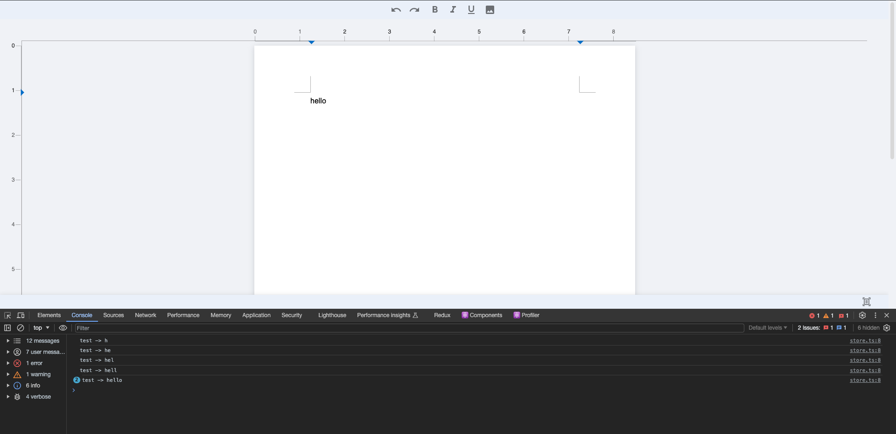

# How to use DOM events

## Get value from page

**onChange**: The onchange event occurs when the value of an page is changed.

```javascript
export const test = () =>{
    
const handleChange = (data) => {
  console.log('test ->',data);

}

return ( 
        <DocumentEditor 
            onChange={handleChange} 
        />
    )
}
```

## Get select text from page

**onSelect**: The onchange event occurs when the value of an page is selected.

```javascript
export const test = () =>{

const handleSelectedText = (text) => {
  console.log(text);

}
    return ( 
        <DocumentEditor 
            onSelect={handleSelectedText}
        />
    )
}
```

## Set page value
**value**: The value attribute on an tag sets the value of the page.
```javascript
export const test = () =>{
        return ( 
        <DocumentEditor 
            value="Hello world"
        />
    )
}
```

